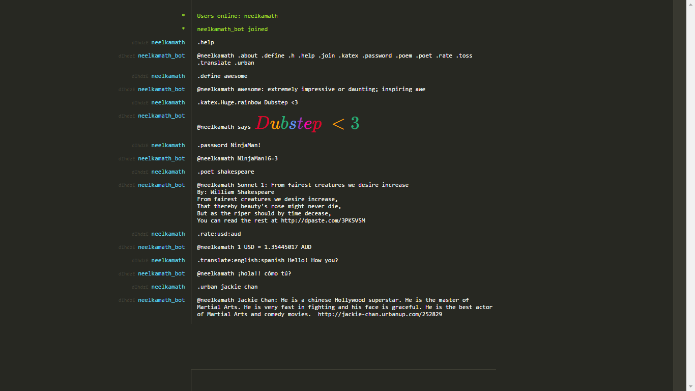

# hack.chat bot

This is a bot running on [hack.chat](https://hack.chat/) for general usage. It is meant to perform tasks quicker than
they would have without it.

# Using the bot

If the bot, `neelkamath_bot`, is online, you can check it out by entering `.help` on ?programming.

# Local install for developers

## Prerequisites

Skipping the optional prerequisites will remove the features specific to them until you do them. So if you haven't
gotten your Oxford API tokens, the dictionary functionality will be absent (until and unless you enter them later) to
prevent crashes.

### Mandatory

- [Python 3 or higher](https://www.python.org/downloads/)
- Install the dependencies: `pip install -r requirements.txt`

### Optional

- [Oxford Dictionaries API tokens](https://developer.oxforddictionaries.com/documentation/getting_started)
- [Currency Converter API tokens](https://www.exchangerate-api.com/)

## Building

1. Clone the repository: `git clone https://github.com/neelkamath/hack.chat-bot`

# Usage

1. Change the directory: `cd hack.chat-bot`
1. Run the script.
    - Windows: `python bot.py`
    - Linux: `python3 bot.py`

# License

This project is under the [MIT License](LICENSE.txt).
